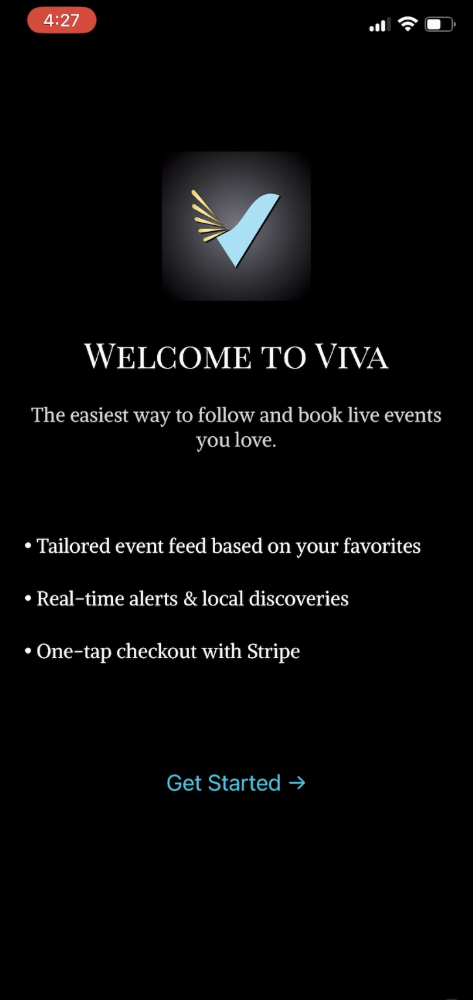

# ***VIVA: Real Life Starts Here***

## *Discover it → Book it → Be there*

VIVA is a mobile app designed to empower spontaneous and intentional discovery of real-life events. Whether you’re exploring your city, traveling to a new place, or simply looking for something to do tonight, VIVA helps you find and attend live events with just a few taps.

# Key Features

- Personalized home feed based on preferences and geolocation

- Tap to explore: comedy shows, sports, concerts, niche events

- Save your favorite artists, venues, teams, genres

- One-click ticket purchasing via Stripe

- Event reminders and easy access to purchased tickets

- Onboarding flow for new users with preference setup

- Secure authentication with JWT

- Beautiful dark-themed UI with smooth navigation

# The Vision

In a world increasingly defined by screen time and isolation, VIVA is designed to pull you back into real life.

*Imagine this*: You're out with friends and want to do something new. You open VIVA, see a comedy show nearby starting in an hour, and book tickets instantly, no long forms, no credit card hassle. Or maybe you just landed in a new city and want to find a concert tonight? VIVA populates your feed with tailored recommendations based on your saved interests and local venues.

***Why VIVA?***

- Reimagines how we interact with events around us

- Enables spontaneous and planned adventures

- Reduces friction between discovery and action

# Target Audience

Ages 18-50

Familiar with mobile-first services (e.g., Uber, Airbnb)

Craves real-world engagement and cultural experiences

Tired of endlessly scrolling on social media

# Tech Stack

## Frontend

React Native (via Expo)

React Navigation (Stack, Drawer, Tab Navigators)

Axios (API requests)

Stripe React Native SDK (in-app payments)

Expo SecureStore (local token management)

Expo Location (geolocation for Nearby Feed)

React Native Reanimated (UI performance)

React Native Gesture Handler (swipe/drag UI)

React Native Toast Message (feedback UI)

Lodash + lodash.debounce (data + performance)

React Native Linear Gradient (styling)

Keyboard Aware ScrollView (form UX)
## Backend

Node.js + Express

Prisma ORM + PostgreSQL

JWT-based authentication

Ticketmaster API integration (event data)

Stripe API integration (ticket purchasing)

# User Experience Flow

1. Sign up or log in

2. Choose favorites (genres, artists, venues, sports teams)

3. Explore personalized feed of upcoming events

4. Save events to your profile or buy tickets instantly

5. Use Nearby tab to find events on-the-fly in your current location

6. Return later and jump straight to Home Feed (token persists)

# Demo

*Click the image above, then "View raw" to watch a 1-minute walkthrough of the VIVA app*

<!-- ⚡ Getting Started (Local Dev)

# 1. Clone the repo
https://github.com/yourusername/viva-app.git

# 2. Install dependencies
cd viva-app
npm install

# 3. Start Expo server
npx expo start

Prerequisites

Expo Go installed on your iOS or Android device

API server running locally (Express + PostgreSQL)

.env file for backend config (API keys, database URL, etc.) -->

# Future Plans

- Let users follow friends and share event plans

- Last-minute ticket deals feed

- Add small/local event organizers to platform (event upload form)

- Push notifications for preference matches

# Acknowledgments

Ticketmaster API

Stripe

Expo + React Native community

# About the Developer

Built with care by Halsey Swetzoff. The VIVA app and myself still a work in progress.

I'm passionate about building tools that bring people together in the real world. VIVA is a reflection of how I believe tech can make our lives more exciting, social, and connected.

If you’re hiring or collaborating, let’s talk!